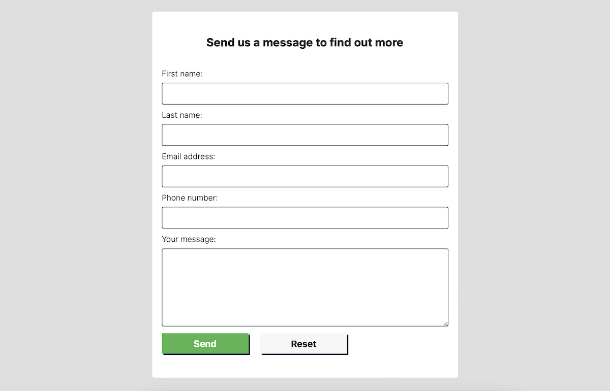

# Akemi Renewable Energies

Akemi is a business that provides solutions for renewable energy projects. It does this by offering a full cycle approach, from initial consultation, to project creation and implementation. It has a target audience from small to large businesses, agrobusinesse and residential home owners.

### Project objectives

1. Create a website that will serve as a landing page for prospect clients where they can access information about how the company can meet their needs of renewable energy solutions;
2. Generate leads of prospect clients by capturing their contact details;

You can follow the project along by visiting the [Akemi website here](https://andrebraga7.github.io/akemi)

# Table of content

- [**User Experience UX**](#user-experience-ux)
    - [Wireframes](#wireframes)
    - [Site structure](#site-structure)
    - [Design choices](#design-choices)
        - [*Typography*](#typography)
        - [*Colour scheme*](#colour-scheme)
- [**Features**](#features)
    - [Home](#home)
        - [*Navigation*](#navigation)
        - [*Hero image*](#hero-image)
        - [*Our solutions*](#our-solutions)
        - [*How we can help*](#how-we-can-help)
        - [*Call to action*](#call-to-action)
        - [*Footer*](#footer)
    - [About](#about)
        - [*About cover image*](#about-cover-image)
        - [*About us*](#about-us)
        - [*Some of our projects*](#some-of-our-projects)
    - [Contact](#contact)
        - [*Contact cover image*](#contact-cover-image)
        - [*Form*](#form)
    - [Future features](#future-features)
- [**Technologies Used**](#technologies-used)
- [**Testing**](#testing)
- [**Deployment**](#deployment)
    - [To deploy the website](#to-deploy-the-website)
    - [To fork the repository on GitHub](#to-fork-the-repository-on-github)
    - [To create a local clone of the project](#to-create-a-local-clone-of-the-project)
- [**Credits**](#credits)
    - [Content](#content)
    - [Media](#media)
- [**Acknowledgements**](#acknowledgements)

# User Experience (UX)

## Wireframes

The wireframes for the Akemi website were created using [Balsamiq](https://balsamiq.com/). The mobile version of the site was created following the main full width wireframe and adding adjustments as needed to acomodate the smaler screens.

[Back to table of content](#table-of-content)

## Site structure

The website is composed of three pages, [**Home**](index.html), [**About**](about.html) and [**Contact**](contact.html). The home page is the primary landing page where the user is greated with a cover image that gives a first impression of what the website is about with a call to action button. The about and contact pages can be accessed throught the navigation menu on the header of the page. There is also links to all the pages on a secondary menu in the footer. All the call to action buttons link to the contact form.

[Back to table of content](#table-of-content)

## Design choices

- ### Typography

    The font chosen for this project was [Inter](https://github.com/rsms/inter/) designed by [Rasmus Andersson](https://fonts.google.com/?query=Rasmus+Andersson). It has a fall back font of sans-serif. This font was chosen because it has a similar design to the company's logotype. It also has some great readability features like stated by the designer:
    >Inter features a tall x-height to aid in readability of mixed-case and lower-case text. Several OpenType features are provided as well.

- ### Colour scheme
    The colour scheme chosen follows and builds upon the companys visual idendity, which relates to the application of renewable energies.

    

[Back to table of content](#table-of-content)

# Features

The Akemi website is designed and laid out following the common sense website design, which contains a navaigation menu on the top of each page, relevant content in the middle section and a footer at the very bottom. It also follows good practice of UX generating a welcoming feelling encouraging the user to explore all of it's features whilst providing usefull information about the company and it's solutions, projects and contact information.

## Home

- ### Navigation
    Located at the very top of each page, it has a responsive deisign containing the company's logo which is clickable and links back to the home page. It also has navigation links to the other pages with a thick white border underlining the active page, which provides feedback to the user on what page he is currently on.

    

[Back to table of content](#table-of-content)

- ### Hero image
    Bellow the menu comes the websites main hero image. It sets the mood straight away whilst also providing visual clues of what the site is about. On top of the image there is a first call to action text with a button, that invites the user to fill in his contact information in exchange of booking a free call with one of the companys specialist. The call to action button links to the contact form.

    

[Back to table of content](#table-of-content)

- ### Our solutions
    The our solutions sections, provides the user with information about what types of renewable energy the company works with and some of the benefits of each type. Information is displayed on top of a relevant background for each of the energy types, following the same design principle for the website. On smaller screens they sit on top of each other.

    

[Back to table of content](#table-of-content)

- ### How we can help
    This section focuses on providing more information to the user about the different types of customers the company works with. Giving a brief introduction on each typer of application.

    

[Back to table of content](#table-of-content)

- ### Call to action
    Located on top of the footer, this section is the second call to action on the home page. Like the first one, it invites the user to fill in his contact information on the contact form the button links to in exchange of a free cal by one of the companys specialists.

    

[Back to table of content](#table-of-content)

- ### Footer
    The footer section at the very bottom of each page has a responsive design and is made up of the following features:
    - The companys logo which is clikable and links to the top of the home page;
    - A navigation meny with links to all the pages and a user feedback thick white border underlining the active page;
    - The companys contact information and address;
    - The websites copyright informations;
    - Social media links.

    

[Back to table of content](#table-of-content)

## About

- ### About cover image
    The cover image is represented by a commercial container building with solar panels on the roof which relates to what the company is about. It also has a title on top of the image that gives further explanation of the purpose of the about page.

    

[Back to table of content](#table-of-content)

- ### About us
    The about us section gives a brief introduction to the history and business of the company.

    

[Back to table of content](#table-of-content)

- ### Some of our projects
    This section showcases some of the company projects. It has three items with an image and description with details of the project. It gives users and idea of what is possible and what they can expect as a result from the companys solutions.

    

[Back to table of content](#table-of-content)

## Contact

- ### Contact cover image
    The contact cover image displays an engineer inspecting a solar panel in a solar farm. This gives further visual clues for the user of the support that can be expected. It also contains a title encouraging the user to contact the company.

    

[Back to table of content](#table-of-content)

- ### Form
    - The form section provides the user with an option to contact the company by providing aditional information. The form has 5 text input fields: First name, Last name, Email, Phone number and the user message. All the fields have labels assigned.
    - At the bottom of the form there are the send and reset button. For the purpose of this project, the form does not have an action asigned to it. It only resets the form to give the user some feedback thar the send button has responded to the click.

    

[Back to table of content](#table-of-content)

## Future features

- A hamburguer menu for smaller screens;
- Create an image carousel on each project of the some of our projects section;
- Add a pop-up display confirmation for when the contact form is submited.

[Back to table of content](#table-of-content)

# Technologies Used

- [HTML5](https://html.spec.whatwg.org/multipage/) - provides the structure for the content of the website;
- [CSS3](https://www.w3.org/Style/CSS/Overview.en.html) - styles the content of the page;
- [Gitpod](https://www.gitpod.io/) - used to edit the website;
- [GitHub](https://github.com/) - used to host and deploy the website.

[Back to table of content](#table-of-content)

# Testing
Please refer to the [**TESTING**](TESTING.md) file for more information about the testing of Akemi Renewable Energies.

[Back to table of content](#table-of-content)

# Deployment

## To deploy the website
The website was deplyoed to GitHub pages. You can fallow the steps below to deploy a webpage:

1. In the GitHub repository, click on the **Settings** tab;
2. Select the **Pages** option on the left hand side;
3. Under source, set the Branch to **main** and click on **Save**;
4. Once the changes are saved, a link to the live website will appear on the top of the page. It may take a few minutes until the website is published.

You can access the GitHub repository by clicking the following link: [https://github.com/andrebraga7/akemi](https://github.com/andrebraga7/akemi)

[Back to table of content](#table-of-content)

## To fork the repository on GitHub
You can create a copy of the repository by forking the GitHub account. This copy can be changed and edited without affecting the original repository. Follow the steps below to fork the repository:

1. Log in to the GitHub account and locate the [repositoty](https://github.com/andrebraga7/akemi);
2. On the top right hand side of the page, click the **Fork** button to create a copy of the original repository on your GitHub account.

[Back to table of content](#table-of-content)

## To create a local clone of the project
To create a clone of the project from GitHub, folow the steps below:

1. In the repository page, click on the **Code** tab;
2. On the **Clone HTTPS** section, click the copy button to copy the repository URL;

3. In your IDE of choice, open **Git Bash**;
4. Change the current working directory to the location where you want the cloned directory to be made;
5. Type **git clone** and then paste the URL copied from GitHub;
6. Press **enter** to create the local clone.

[Back to table of content](#table-of-content)

# Credits

## Content
- The **Inter** font used is from [**Google Fonts**](https://fonts.google.com/specimen/Inter?query=inter) and was created by [**Rasmus Andersson**](https://fonts.google.com/?query=Rasmus+Andersson);
- The icons used are from [**Font Awesome**](https://fontawesome.com/);
- [**Balsamiq**](https://balsamiq.com/wireframes/) was used to create the wireframes.

## Media
- All the photos used came from royalty free stock from [**Pexels**](https://www.pexels.com), [**Pixabay**](https://pixabay.com) and [**Unsplash**](https://unsplash.com);
- The link for each individual image can be found as a comment in the code;
- The Akemi logo and visual identity was provided by the company's owner [**Filipe Braga**](https://www.linkedin.com/in/filipe-braga-a8795b19/).

[Back to table of content](#table-of-content)

# Acknowledgements
This website was created as the first portfolio project for the Full Stack Software Developer course from [**Code Institute**](https://codeinstitute.net). I would like to thank my mentor, [**Precious Ijege**](https://www.linkedin.com/in/precious-ijege-908a00168/) for his guidance and support throught this project and the Code Institute team.

[**Andre Braga**](https://www.linkedin.com/in/andrestrevisan/) 2022

[Back to table of content](#table-of-content)