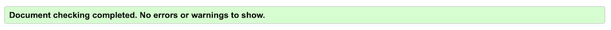
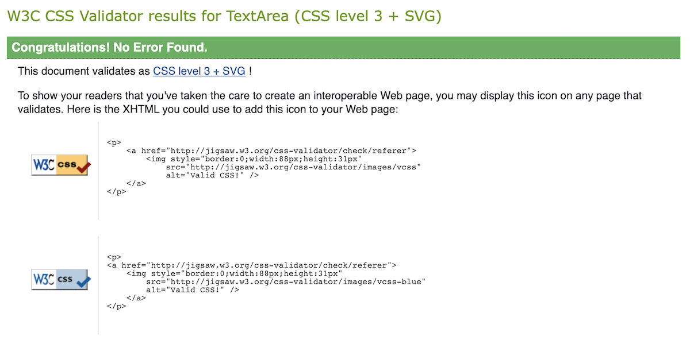

# Testing

## Code validation

The Akemi website has been throughly tested and all the code has been run through the [W3C HTML validator](https://validator.w3.org/) and the [W3C CSS validator](https://jigsaw.w3.org/css-validator/). Both validators returned with no errors on any of the pages.

Below are the HTML validator results for each of the pages:

- ### Home page

    

- ### About page

    

- ### Contact page

    

Bellow are the CSS validator results:

