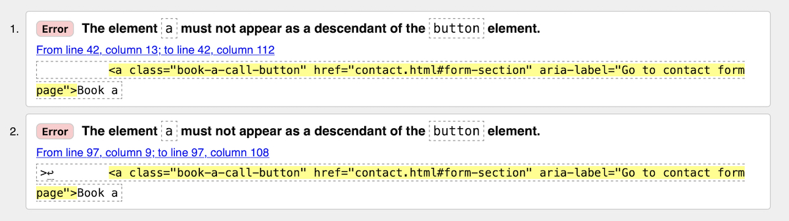
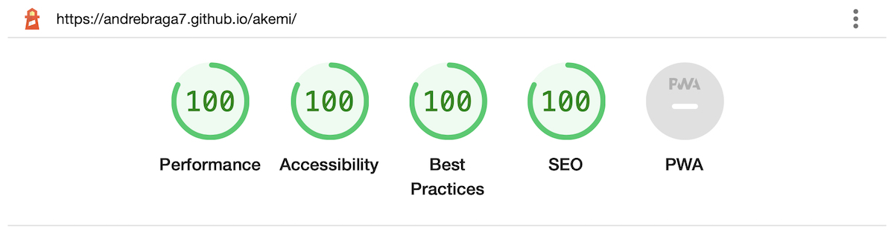

# Testing

## Code validation

The Akemi website has been throughly tested and all the code has been run through the [W3C HTML validator](https://validator.w3.org/) and the [W3C CSS validator](https://jigsaw.w3.org/css-validator/). Minor errors were found on the home page, after a quick fix and retest, no more errors were returned by both validators.

Below are the HTML validator results for each of the pages:

- ### Home page

    

- ### About page

    

- ### Contact page

    

- ### Contact form confirmation

    

Below are the CSS validator results:

# Responsiveness test

The responsive design test was carried out manually through [**Google Chrome DevTools**](https://developer.chrome.com/docs/devtools/) and [**Responsive Design Checker**](https://responsivedesignchecker.com/).

|        | Soni Xperia Z2 | Samsung Galaxy S7 | Apple iPhone 7 | Apple iPad Mini | Apple iPad Pro| Display <1024px | Display >1024px |
|--------|:--------------:|:-----------------:|:--------------:|:---------------:|:-------------:|:----------------:|:----------------:|
| Render | pass           | pass              | pass           | pass            | pass          | pass             | pass             |
| Images | pass           | pass              | pass           | pass            | pass          | pass             | pass             |
| Links  | pass           | pass              | pass           | pass            | pass          | pass             | pass             |

Note: The website has a maximum width of 1440px, this ristrics the content of the site spreading too much on wider displays, providing a better UX.

# Browser compatability

The website was tested on a wide range of browsers and didn't present any visual issues for the user, **Google Chrome**, **Microsoft Edge**, **Safari** and **Mozilla Firefox**. The apearance, functionality and responsiveness was consistent throughout the browsers and device sizes.

# Known bugs

- ## Resolved
    - During the validation check, two errors were found on the home page. Below is a quick description and the fix used:

        
        
        Both errors were related to the same problem. This was easily fixed by removing the \<button> element, and styling the \<a> element as a button.

- ## Unresolved
    - The data from the form on the contact page doesn't push anywhere. This is due to the limitations of this portfolio project. However it can be easily fixed for a true live version of the website.

# Aditional testing

## Lighthouse

The website was also tested using [**Google Lighthouse**](https://developers.google.com/web/tools/lighthouse) in the Chrome DevTools to test each of the pages for:
- Performance - how the website performs on loading;
- Accessibility - how is the accessibility for all users and sugested improvements;
- Best practices - website conformity to industry best practices;
- SEO - Search Engine Optimizationhow, how the website is optimized for search engine results and ranking.

    Here are the results achieved for the Akemi website in Lighthouse:

    

## Peer review

The website also whent throught some peer reviews, both in the software development field and outside by other users. In general the reviews were positive, with some minor adjustments needed in some responsive design, which were easily fixed within the CSS. There were some minor grammar and speeling errors that were also fixed.

Back to [**README file.**](README.md)